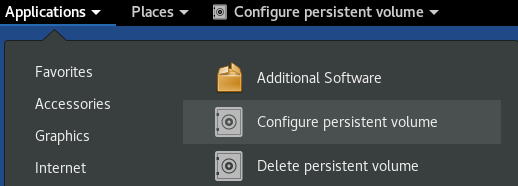
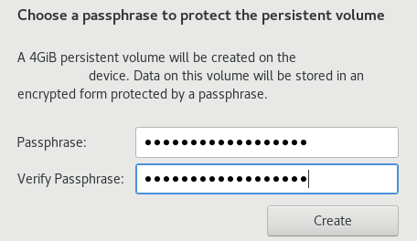
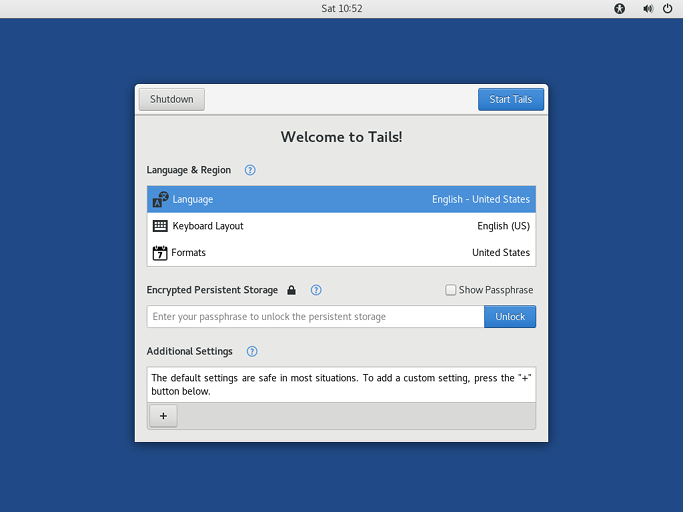
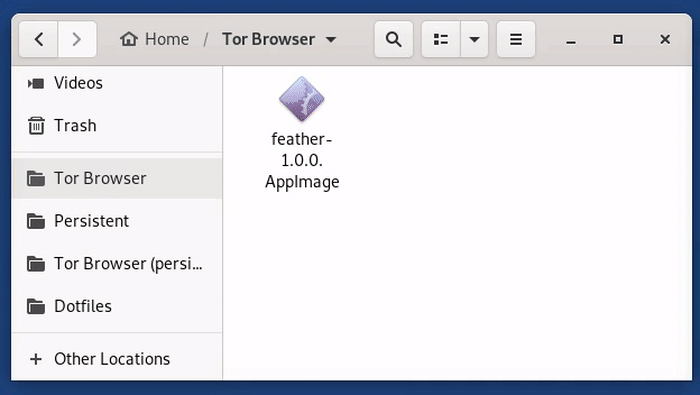
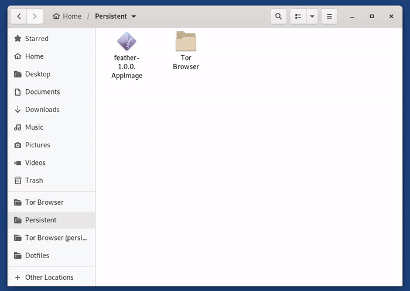

# Operating System

You will be using Tails for all of your orders. Tails is a live operating system that you can start on almost any computer from a DVD, USB stick, or SD card. It aims at preserving your privacy and anonymity, and helps you to:

- use the Internet anonymously and circumvent censorship (because all connections to the Internet are forced to go through the Tor network)
- leave no trace on the computer you are using unless you ask it explicitly and
- use state-of-the-art cryptographic tools to encrypt your files, emails and instant messages

It's a pretty useful operating system for doing things that you do not want others to find out about, and you do not need to install any additional tools for using purchasing goods, everything you need as a buyer is already installed.

## Is it necessary?

**YES.** Even if you think nobody will go after you, let me give you an example: you use Tor browser on Windows to make your order and everything goes fine. Your package gets caught by customs because the vendor did not package it correctly. Now law enforcement starts to investigate because someone tried to send illegal drugs to you. They will deliver the package to you, you will accept it and they will raid your house shortly afterwards because you are in possession of illegal drugs. 

Since you used Windows, everything you did will be dug up with [DiskDigger](https://diskdigger.org/) and you go to prison. Alternatively, you could have been using Tails and no one would know what happened on that flash drive, it's all wiped when you're done, they can't even prove you used Tails. 

## Do I need a VPN? 

Absolutely not. I don't care if your provider "doesn't log", Tor is the best protection you can get. Here's an excerpt from the Tails website:

> Some users have requested support for VPNs in Tails to “improve” Tor’s anonymity. You know, more hops must be better, right?. That’s just incorrect – if anything VPNs make the situation worse since they basically introduce either a permanent entry guard (if the VPN is set up before Tor) or a permanent exit node (if the VPN is accessed through Tor).

> Similarly, we don’t want to support VPNs as a replacement for Tor since that provides terrible anonymity and hence isn’t compatible with Tails’ goal.

No buyer has ever been caught by Tor de-anonymization. Plenty have been caught after a VPN provider subpoena.

## I already ordered without Tails, what now?

Uninstall everything you used for your order, like crypto wallets and browsers. Now, you need to overwrite the free space on your disk. This will remove any recoverable data from your hard drive and replace it with garbage data (see [this article](https://slate.com/news-and-politics/2005/06/can-you-ever-erase-a-computer-file.html) for more info). It will not overwrite or delete any of your existing files. Here is a guide on how to do it in [Windows](http://www.howtogeek.com/137108/how-securely-overwrite-free-space-in-windows/), [Mac](http://osxdaily.com/2016/04/28/erase-free-space-mac-command-line/) and [Linux](https://ssd.eff.org/en/module/how-delete-your-data-securely-linux). 

Note that this is not 100% secure and absolutely is not an alternative to Tails

## How do I set up Tails to remember important information?

Normally Tails forgets every change you made on it when you reboot (that is why it is called amnesiac). However when you want to order, you probably need to save some files. This is possible by setting up the persistence volume which encrypt, and store your data after restarting. Tails uses LUKS or, Linux Unified Key Setup to encrypt your data, keeping it safe from bad actors

You can make Tails save: 

- Personal Data
- Browser Bookmarks
- Network Connections
- Additional Software
- Printers
- Thunderbird
- GPG
- Bitcoin Client
- Pidgin
- SSH Client
- Dotfiles

#### Creating Persistence 
- To create or configure your Persistent Storage, simply go to: Application > Tails > Configure persistent volume
 

- Specify a passphrase of your choice in both the Passphrase and Verify Passphrase text boxes. The best way to create a password that is both strong and memorable is to create a mnemonic of at least 4 words. 

- Click the create button and a list of features should appear. 
- You will probably want to enable Personal data, GnuPG, Bitcoin client, and Dotfiles. Others can be added later if you want them.
- Restart your machine, and your welcome screen should now look like this:

Once you login, you can now save your personal files, and working documents in the Persistent folder. To open the Persistent folder choose Places -> Persistent. Your other tools you enabled will save automatically. Make a [backup](https://tails.net/doc/persistent_storage/backup/) every once in a while so you don't lose your coins or accounts. 

## Is it okay to use my own WiFi?

Your ISP will only know that you're using Tor, nothing that you're doing. If this isn't okay with you, you can always tell Tails to use bridges by using the “My computer’s Internet connection is censored, filtered or proxied” in the setup. This will make your traffic appear to be normal web traffic, though it's best to save thise resources for people who need them. Using public WiFi introduced unnecessary risks and should be avoided. 

## How do I set up a Monero wallet on Tails?

- Download the latest Feather AppImage for Tails from [featherwallet.org](https://featherwallet.org/download/) and move it to your persistent directory 

- Make the app executable by right clicking on the AppImage and going to Properties > Permissions > Allow executing file as program

You can now easily create a wallet from the Feather AppImage. 

## I've read everything else, how do I install Tails?

The Tails project has an excellent guide [here](https://tails.net/install/index.en.html). You should upgrade your Tails install at least once a month with [this guide](https://tails.net/doc/upgrade/).
